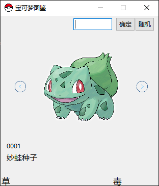
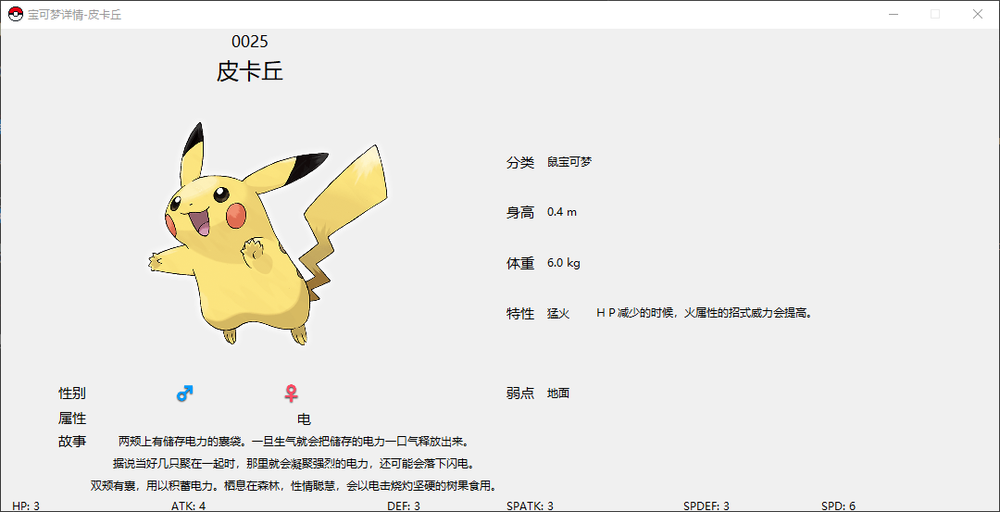

1. Pokemon官方网站原版下载制作数据库pokemon.db
   Crawl data from original pokemon website to make database pokemon.db

2. 由此制作宠物小精灵/精灵宝可梦/神奇宝贝图鉴无线版（tkinter GUI， 无其他依赖，原汁原味！😜）
   So here we are！ We have pokemon pictorial book offline version! There is no extra dependencies. Just using tkinter to make GUI.

3. 用nuitka发布
   Using nuitka to release.

ps:
`python -m nuitka pokemon.py --enable-plugin=tk-inter --windows-disable-console --include-data-dir=resources=resources --windows-icon-from-ico=resources/favicon.ico --standalone`

